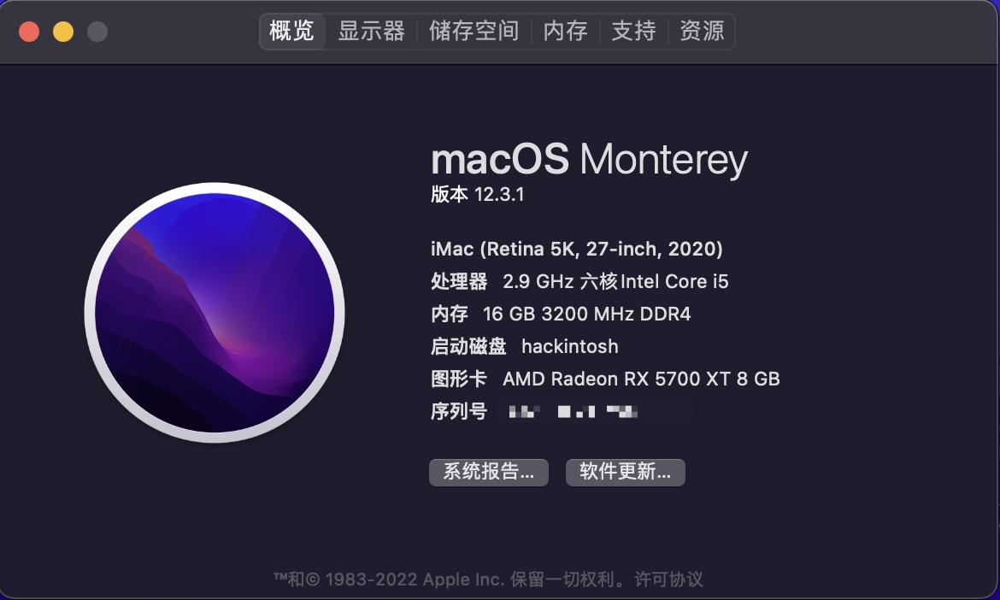
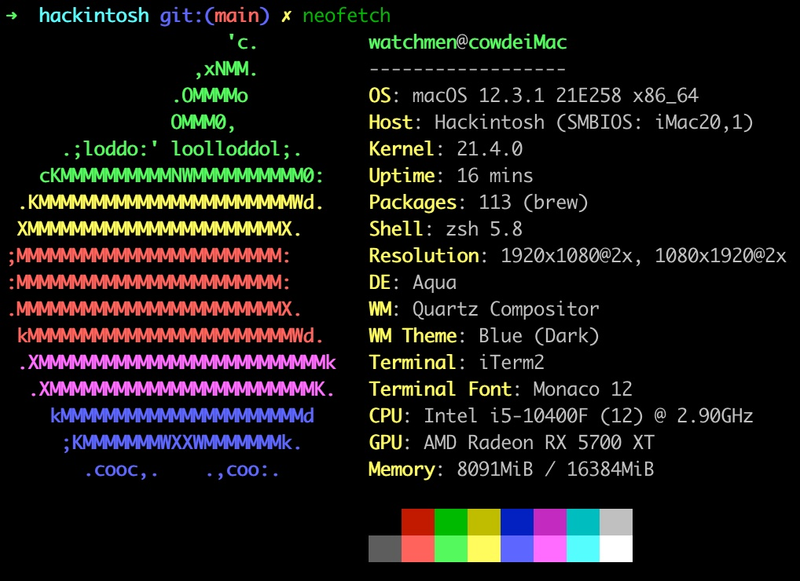
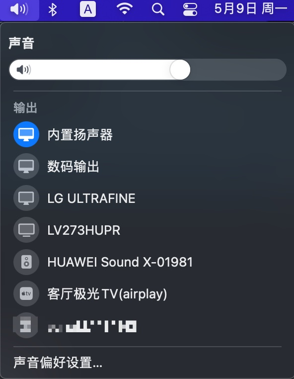
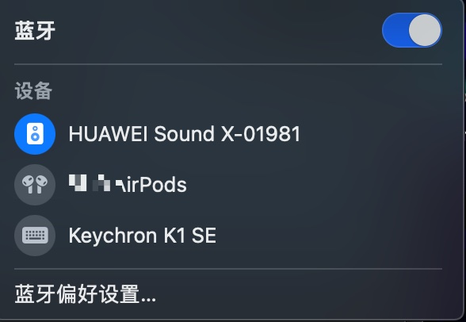

# MSI-B560m-Bomb_i5-10400f_5700xt

- CPU: 十代i5-10400f
- 主板: MSI B560m bomb
- 内存: 海盗船3200mhz 8G*2
- ssd: 三星 nvme 970 evo plus 500G
- PCI免驱网卡: Fenv-T919 (便于使用wifi和bluetooth)

### 完美运行Monterey 12.3.1 基于opencore 0.8.0

icloud可登录，airdrop，接力，隔空等都可以正常使用，wifi正常，2.5g有线正常，内置声卡正常，睡眠正常

USB已定制，其实爆破弹这块板不定制也不会超过15个😂

如果你配置和我一样，**修改三码**后就可以直接使用了

### 小絮叨

2022年了，本人公司有配一台M1 MAX的MBP，家里有一台2019年的intel芯片带触控toolbar的MBP，为啥还要折腾hackintosh，搞程序的人都有这口折腾玩意的特殊癖好吧。这中间我花了很多时间看了很多英文的教程文档以及视频，熬了几宿的夜，一直到白色的苹果出现在PC的屏幕上时候其实还是有那么一点点兴奋的。去年我还折腾过一台AMD 3900X的hackintosh，[AMD-3900x](https://github.com/echokk11/AMD-3900x_MSI-MEG-UNIFY-X570_5700xt_hackintosh_opencore)，但是碍于虚拟方面有点问题就没有深度使用。

我最近还装了台12代i7，地址在 https://github.com/echokk11/Hackintosh_i7-12700kf_ASUS-B660M-PLUS-D4_5700xt

目前互联网上的教程太杂太乱，对于新手及其不友好，分享的东西也都是有头无尾，所以我打算写一篇详细的教程，敬请期待。

### 参考且鸣谢

[B站**大头蔡Cass**的系列教程](https://www.bilibili.com/video/BV113411n7W3?spm_id_from=333.999.0.0)

[olarila.com](https://www.olarila.com/topic/20908-guide-easy-fast-and-perfect-hackintosh-vanilla-step-by-step/)

### 部分系统截图分享

